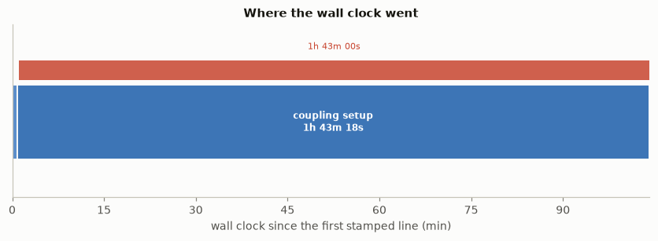
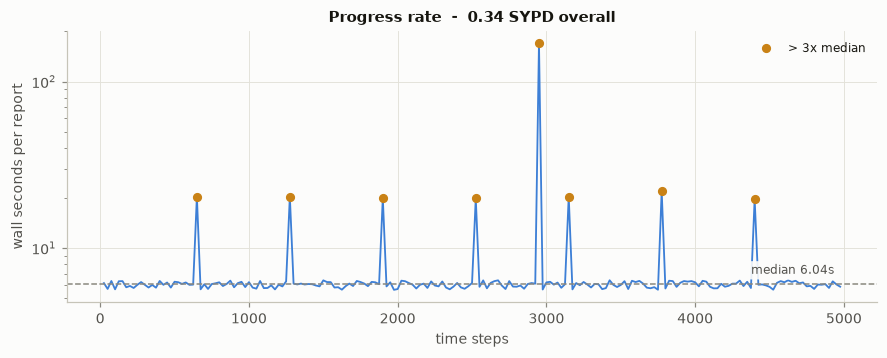
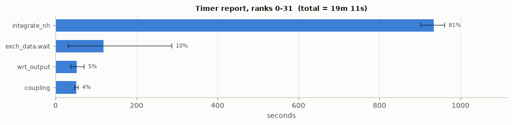
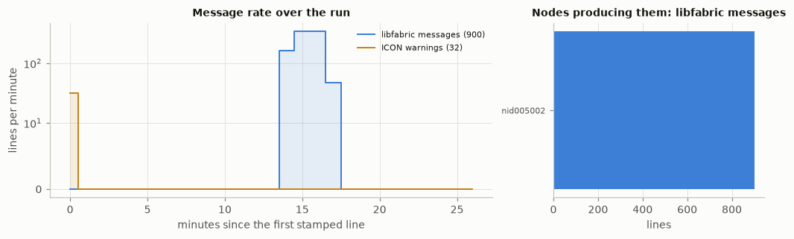

# runhealth

**Read a folder of HPC batch job logs. Get a report that says how the runs went.**

Did it finish? Did it hang, and where? How fast was it, and did it slow down?
Was the work spread evenly across ranks? Was the machine underneath it healthy?
Those answers are all in the log already. `runhealth` reads them out.

```bash
runhealth /path/to/logs -o report/ --open
```

<p align="center">
  
</p>

<p align="center"><em>One picture, one diagnosis: the job spent its entire
allocation in the coupling setup and never wrote another line.</em></p>

It is **model-agnostic**. The core understands batch logs -- timestamps, SLURM
records, silence, error signatures -- and everything specific to a code lives in
a **YAML profile**, so supporting your own model means writing a few regular
expressions, not Python. ICON and Cray MPICH profiles ship with it.

---

**Contents**

[See it work](#see-it-work) &middot;
[Install](#install) &middot;
[Recipes](#recipes) &middot;
[Reading the report](#reading-the-report) &middot;
[Output formats](#output-formats) &middot;
[Profiles](#profiles) &middot;
[Running jobs](#running-jobs) &middot;
[Performance](#performance) &middot;
[Get more out of your logs](#get-more-out-of-your-logs) &middot;
[Troubleshooting](#troubleshooting) &middot;
[Reference](#command-line-reference) &middot;
[Development](#development)

---

## See it work

Two sample logs ship with the repository. No cluster needed:

```bash
runhealth examples/ --glob '*.log' -o /tmp/demo --open
```

```
runhealth: parsed 2 log(s) in 0.2s
  WARN  SUCCESS      26m 18s  demo.log       - 8 of 199 intervals took more than 3x the median
  FAIL  FAILED    1h 44m 10s  demo_hang.log  - CANCELLED AT 2026-03-17T22:48:18 DUE TO TIME LIMIT
runhealth: wrote /tmp/demo/index.html
```

Open `/tmp/demo/index.html`. `demo.log` is a run that finished but hit a fabric
hiccup halfway through; `demo_hang.log` is the same job stuck in its coupling
setup until the scheduler cut it off.

On real logs the summary reads the same way. This is one afternoon of a coupled
climate model:

```
runhealth: parsed 11 log(s) in 12.6s
  WARN  SUCCESS      19m 52s  LOG.jcp_r2b8_icon4py.839444.o   - Worst timer runs 11.57x slower on the slowest rank
  FAIL  SUCCESS      53m 49s  LOG.jcp_r2b10_icon4py.832847.o  - 640.9k dropped flow-control messages, 641.1k in one minute
  FAIL  FAILED            19s  LOG.jcp_r2b10_icon4py.831673.o - srun exit status 143, finish_atmo.status missing
  WARN  SUCCESS   2h 40m 00s  LOG.jcp_r2b8_icon4py.831554.o   - 23m 44s of silence during setup
  FAIL  FAILED    2h 15m 20s  LOG.jcp_r2b8_icon4py.828160.o   - CANCELLED DUE to SIGNAL Terminated
```

The second line is the one worth having: that run *succeeded*, and would never
have been looked at again. It was also, for one minute, drowning in a network
retry storm.

### What you get

```
report/
  index.html                  every run, one row each, sortable and filterable
  LOG.myjob.12345.html        one page per run: checks, figures, tables
  images/*.png                the figures
  .cache/                     parsed state, so the next pass is instant
```

## Install

Only [uv](https://docs.astral.sh/uv/) is needed; it fetches a suitable Python
itself.

```bash
git clone <this repo> runhealth
cd runhealth
uv sync
uv run runhealth --help
```

Add `uv run` in front of `runhealth` in every example below, or activate the
environment once with `source .venv/bin/activate`.

<details>
<summary>Tight inode quota? Put the environment elsewhere</summary>

The environment holds a few thousand files, which some parallel file systems
count against you.

```bash
export UV_PROJECT_ENVIRONMENT=$SCRATCH/venvs/runhealth
uv sync
```

Keep that variable exported for `uv run` as well.
</details>

<details>
<summary>Prefer pip?</summary>

```bash
pip install -e .
runhealth --help
```

Requirements: Python 3.11 or newer, `matplotlib` and `pyyaml`.
</details>

## Recipes

| You want to | Run |
| --- | --- |
| Look at everything in a directory | `runhealth /path/to/logs -o report/` |
| Look at one log and open it | `runhealth LOG.myjob.12345.o -o report/ --open` |
| Only the recent ones | `runhealth /path/to/logs --last 5 --since 7d -o report/` |
| Follow a job that is running now | `runhealth /path/to/logs --watch 60 -o report/` |
| A Markdown report instead | `runhealth /path/to/logs -f md -o report/` |
| Just a terminal summary, fast | `runhealth /path/to/logs -o report/ --no-plots` |
| See which logs would be read | `runhealth /path/to/logs --list` |
| Logs with an unusual name | `runhealth /path/to/logs --glob 'job-*.txt' -o report/` |
| Ignore what the model profile knows | `runhealth /path/to/logs --profile slurm -o report/` |
| Use your own profile | `runhealth /path/to/logs --profile-dir ./my-profiles -o report/` |

Everything is written under `-o`, and re-running over the same directory reuses
the cache, so it costs about a second.

## Reading the report

### The index

One row per run, sortable by any column and filterable by health grade, with
wall clock, throughput and longest silence side by side. Useful for spotting the
point at which a series of runs started to degrade.

Grades are `ok`, `worth a look`, `warning` and `problem`. A run's grade is the
worst of its checks.

### The checks

Each run page opens with a list of checks. A check states what it found and
lists the evidence behind it, so nothing has to be taken on trust.

| Check | What it means |
| --- | --- |
| **Outcome** | Did the job report success, fail, or end without saying? SLURM's own verdict is included when `squeue` still knows the job. |
| **Silence** | The longest stretch with no output. Silence *inside* the main loop, or in a run that never reached its loop, is a failure. Silence during setup is judged against a longer threshold, because reading input and compiling kernels legitimately take minutes. |
| **Wall time** | How much of the requested limit was used, and whether the scheduler cut the job off. |
| **Throughput** | Progress reached and the rate, in the unit the profile names (SYPD for a climate model). |
| **Throughput drift** | Whether the run slowed between its first and last quarter, which points at something degrading rather than a single bad moment. |
| **Slow intervals** | Individual progress intervals far above the median: output, checkpointing, or a transient stall. |
| **Where the time went** | The largest timers, as a share of the total. |
| **Load imbalance** | How much longer the slowest rank spent in each timer than the fastest. This never fails a run on its own; it is a performance observation, and spread on a *wait* timer is the symptom of imbalance created somewhere else. |
| **Checkpoint write / Output cost** | Volume and rate of restart writes, and the share of the run spent in output timers. |
| **Network** | Fabric counters and warnings. A burst of dropped flow-control messages means the network, not the code, was the limit. |
| **Suspect nodes** | Nodes named in step failures, or carrying a disproportionate share of the warnings. Ready to paste into an `--exclude=` list. |
| **Errors** | Error-looking lines collapsed by shape, with digits masked so the same message from a thousand ranks becomes one row. |

Checks a profile cannot feed simply do not appear. A completely unknown log
still gets outcome, silence, wall time and errors.

### The figures

**Progress rate** -- wall time between successive progress reports. Flat is
healthy. The regular small spikes here are hourly output; the tall one is a
network stall that output alone does not explain.



**Where the time went** -- top-level timers, one panel per rank group. The bar
is the average across ranks and the whisker spans fastest to slowest, so a long
whisker is imbalance. `exch_data.wait` below is 10 % of the run on average but
about 25 % on the slowest rank.



**Message rate** -- message families per minute across the run, beside the nodes
producing them. A burst that lines up with a slow stretch in the progress plot
points at the fabric rather than the code.



Plus, on every page that has the input for them: the **run timeline** at the top
of this README, the **longest silences** each labelled with the last line before
it, **load imbalance** per timer, and the **network counter spread** between the
least and most loaded NIC.

Every figure is skipped rather than faked when the log does not contain what it
needs.

## Output formats

- `--format html` (default): `index.html` plus a page per run. Light and dark
  themes, and a real print stylesheet -- the browser's **Print to PDF** produces
  a clean document with sensible page breaks.
- `--format md`: `report.md` with the same figures, in GitHub-flavoured
  Markdown.
- `--format pdf`: uses [WeasyPrint](https://weasyprint.org/) if it is installed
  (`uv sync --extra pdf`). Without it, `runhealth` writes the HTML and tells you
  to print it, rather than failing. WeasyPrint is not a hard dependency because
  it is large and the browser route is just as good.

## Profiles

A profile is a YAML file describing what a code prints. Profiles compose:
`slurm` (always applied) plus `icon` plus `cray-mpich` describe an ICON run on a
Cray machine, and each is detected from the content of the log itself.

```bash
runhealth --list-profiles
# cray-mpich     Cray MPICH / Slingshot: CXI counters, libfabric warnings
# icon           ICON atmosphere/ocean model: progress, timer report, coupling
# slurm          SLURM batch job metadata, step failures and cancellations. (always applied)
```

| Profile | Detects | Contributes |
| --- | --- | --- |
| `slurm` | always | `#SBATCH` directives, the SLURM environment, `srun` step failures, cancellations, wall-clock limits |
| `icon` | ICON output or a generated ICON runscript | time steps and SYPD, the timer report, coupling and I/O phases, `WARNING PE` families, the success/failure protocol |
| `cray-mpich` | Slingshot or libfabric output | the CXI counter summary, libfabric flow-control warnings, MPICH aborts |

### Adding your own

Drop a YAML file in a directory and point `runhealth` at it:

```bash
runhealth /path/to/logs --profile-dir ./my-profiles
export RUNHEALTH_PROFILE_DIR=$HOME/.runhealth   # or set it once
```

Here is a complete profile for a solver that prints
`iteration 42, residual 1.0e-6`:

```yaml
name: mysolver
description: "Iterative solver: progress and convergence"
detect:
  - 'mysolver v[0-9]'

settings:
  progress_label: iterations
  progress_series: iteration

series:
  iteration:
    re: 'iteration (\d+), residual (\S+)'
    fields: [step, residual]
    cast: {step: int}
    role: progress

markers:
  solve_start: {re: 'entering solve', label: solve}

outcome:
  - {re: '^converged in (\d+) iterations', level: ok}
  - {re: '^diverged after (\d+) iterations', level: fail}
```

That is enough for throughput, a progress-rate plot, phase timing, stall
detection against the typical iteration time, and a verdict. `--profile
mysolver` pins it; without that flag it is detected automatically.

The full schema -- timer tables, message families, thresholds, everything --
is in **[docs/profiles.md](docs/profiles.md)**.

## Running jobs

A log with no final status is reported as **RUNNING** while it is still being
written, and as **INCOMPLETE** once it has gone quiet -- the silence check then
says where it stopped.

When `squeue` is available, `runhealth` asks it for the real state, so a queued
job shows as **QUEUED** rather than as a broken run, and a job the scheduler
still believes is running while its log has gone quiet is reported as
**STALLED** -- the one case where intervening is still worth something.
`--no-squeue` turns that off.

```bash
runhealth /path/to/logs --watch 60 -o report/
```

re-renders on an interval. Each pass resumes from where the last one stopped, so
following a growing 100 MB log costs no more than the new lines.

## Performance

Reading is strictly streaming, line by line, with counters and bounded
shortlists instead of stored lines. A 152 MB, 820k-line log parses in about
12 seconds; 443 MB across 31 logs takes about 30 seconds in parallel, with peak
resident memory in the tens of megabytes.

Results are cached under `<outdir>/.cache/`, keyed on file size and modification
time, so a second pass over the same folder takes well under a second.
`--no-cache` disables it.

## Get more out of your logs

`runhealth` reports what a log contains. Two cheap changes to a job script make
it contain much more:

**1. Stamp every line with the wall clock.** Without it there is no silence
detection -- the single most valuable signal -- no phase timeline and no
progress rate, and `runhealth` says so rather than guessing. Any line-buffered
filter will do:

```bash
pipe=job_$$.pipe
mkfifo $pipe
trap "rm -f $pipe" EXIT
python3 -u -c 'import sys,datetime
for line in sys.stdin:
    print(datetime.datetime.now().isoformat(timespec="milliseconds"), line, sep=": ", end="", flush=True)' < $pipe &
exec > $pipe 2>&1
```

ICON ships `utils/timewarp`, which does exactly this.

**2. Turn on the MPI stack's counters.** On Cray MPICH,
`MPICH_OFI_CXI_COUNTER_REPORT=3` and `FI_LOG_LEVEL=warn` cost nothing and turn
"the run was slow" into "the fabric dropped 640k flow-control messages in one
minute".

Also worth having: `srun -l` (rank labels), and your model's timers switched on.

## Troubleshooting

**"no logs matched"** -- directories are scanned for `LOG.*.o`, `slurm-*.out`,
`*.log` and `*.out` in that order, taking the first shape that matches. Use
`--glob` for anything else, and `--list` to see what would be read. Empty files
are skipped.

**Everything is `INCOMPLETE`** -- no profile recognised your success line. Check
`runhealth --list-profiles`, then add an `outcome` rule in a profile of your
own.

**No throughput, no timeline, no figures** -- either the log has no timestamps
(the run page says which of the three line shapes was found), or no profile
matched. `--profile slurm` shows you the floor: outcome, silence, wall time and
errors.

**A rule in my profile never fires** -- three usual causes: a `contains:`
literal that does not appear in *every* matching line; a pattern anchored with
`^` that is actually indented in the log; or a rule that should have been marked
`preamble: true` because it only appears in the echoed job script. See
[docs/profiles.md](docs/profiles.md).

**A healthy run is graded `warning`** -- look at which check did it. Load
imbalance and slow output intervals are observations, not failures; they are
meant to draw the eye. Thresholds are all adjustable per profile.

**The wall clock looks impossible** -- a file holding several job attempts (a
resubmission appending to the same name) is analysed as its **last** attempt,
and the report says so at the bottom of the page.

## Limitations

- Without line timestamps there is no silence detection, no phase timeline and
  no progress rate.
- Throughput needs a profile that names a progress line. The generic profile
  reports outcome, silence and errors only.
- Load imbalance is read from the model's own timer table. A code that does not
  print one gets no imbalance analysis.
- `runhealth` reads logs. It does not read the model's output files, and it
  says nothing about whether the science is right.

## Command line reference

```
runhealth [PATH ...] [-o OUTDIR] [-f html|md|pdf]
          [--profile NAME[,NAME]] [--profile-dir DIR] [--list-profiles]
          [--glob PATTERN] [--last N] [--since 7d] [--list]
          [--watch SECONDS] [--stall-seconds N] [--dpi N] [--jobs N]
          [--no-plots] [--no-cache] [--no-squeue] [--embed-logs]
          [--title TEXT] [--open]
```

| Option | |
| --- | --- |
| `PATH ...` | files or directories; defaults to the working directory |
| `-o, --outdir` | where the report is written (default `runhealth-report`) |
| `-f, --format` | `html` (default), `md` or `pdf` |
| `--glob` | filename pattern to scan directories with |
| `--last N`, `--since` | keep the N newest, or those newer than e.g. `7d`, `12h` |
| `--profile`, `--profile-dir` | pin profiles by name; add a directory of your own |
| `--list`, `--list-profiles` | show what would be read, or which profiles exist |
| `--watch N` | re-render every N seconds |
| `--stall-seconds N` | override the silence threshold |
| `--dpi`, `--no-plots` | figure resolution, or no figures at all |
| `--jobs N` | parallel parsers (default: one per core, capped) |
| `--no-cache`, `--no-squeue` | skip the parse cache; do not ask SLURM for job states |
| `--embed-logs` | copy logs under 8 MB into the report and link them |
| `--open` | open the report when it is written |

## Development

```bash
uv sync
uv run pytest
uv run python tests/make_fixtures.py     # regenerate the test logs
uv run python examples/make_demo.py      # regenerate the sample logs
```

The test fixtures are small hand-built logs, one per shape: a healthy run, a run
that hangs in its coupling setup, two attempts in one file, a generic SLURM job
from an unknown code, output with no timestamps, and the degenerate cases
(empty, truncated, not a log at all). No real log is committed; they are far too
large, and the figures in this README come from `examples/demo.log`.

The layout:

| Module | |
| --- | --- |
| `logfile.py` | line grammar: timestamps, rank labels, streaming reads |
| `profile.py` | loading, composing and detecting YAML profiles |
| `extract.py` | one streaming pass over a log, producing a `RunLog` |
| `tables.py` | the two table shapes models and MPI stacks print |
| `health.py` | `RunLog` to checks and a grade |
| `plots.py` | the figures |
| `report.py` | HTML, Markdown and PDF rendering |
| `cli.py` | discovery, cache, parallelism, the watch loop |

Formatting is [black](https://black.readthedocs.io/) via `pre-commit`:

```bash
pre-commit install
```

## Licence

BSD 3-Clause. See [LICENSE](LICENSE).
