# runhealth

**Read a folder of HPC batch job logs. Get a report that says how the runs went.**

Did it finish? Did it hang, and where? How fast was it, and did it slow down?
Was the work spread evenly across ranks? Was the machine underneath it healthy?
Those answers are all in the log already. `runhealth` reads them out.

```bash
runhealth /path/to/logs -o report/ --open
```

<p align="center">
  
</p>

<p align="center"><em>One picture, one diagnosis: the job spent its entire
allocation in the coupling setup and never wrote another line.</em></p>

It is **model-agnostic**. The core understands batch logs -- timestamps, SLURM
records, silence, error signatures -- and everything specific to a code lives in
a **YAML profile**, so supporting your own model means writing a few regular
expressions, not Python. ICON and Cray MPICH profiles ship with it.

## Try it

Two sample logs ship with the repository. No cluster needed:

```bash
git clone https://github.com/C2SM/runhealth.git
cd runhealth
uv sync
uv run runhealth examples/ --glob '*.log' -o /tmp/demo --open
```

```
runhealth: parsed 2 log(s) in 0.2s
  WARN  SUCCESS      26m 18s  demo.log       - 8 of 199 intervals took more than 3x the median
  FAIL  FAILED    1h 44m 10s  demo_hang.log  - CANCELLED AT 2026-03-17T22:48:18 DUE TO TIME LIMIT
runhealth: wrote /tmp/demo/index.html
```

## Documentation

The full documentation lives at **<https://c2sm.github.io/runhealth/>**:

- [Install](https://c2sm.github.io/runhealth/install.html)
- [Usage](https://c2sm.github.io/runhealth/usage.html): recipes, following a
  running job, output formats, sharing a report, performance
- [Reading the report](https://c2sm.github.io/runhealth/report.html): what each
  check means, how to read the figures
- [Profiles](https://c2sm.github.io/runhealth/profiles.html) and the
  [profile reference](https://c2sm.github.io/runhealth/profile-reference.html):
  teaching `runhealth` a new code
- [Get more out of your logs](https://c2sm.github.io/runhealth/logging.html):
  two changes to a job script that pay for themselves
- [Troubleshooting](https://c2sm.github.io/runhealth/troubleshooting.html)
- [Command line reference](https://c2sm.github.io/runhealth/cli.html)
- [Development](https://c2sm.github.io/runhealth/development.html)

The sources are Markdown under [`docs/`](docs/); build them locally with

```bash
uv run --group docs sphinx-build -b html docs docs/_build/html
```

## Licence

BSD 3-Clause. See [LICENSE](LICENSE).
